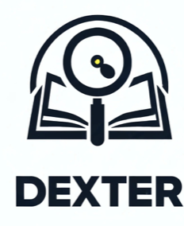
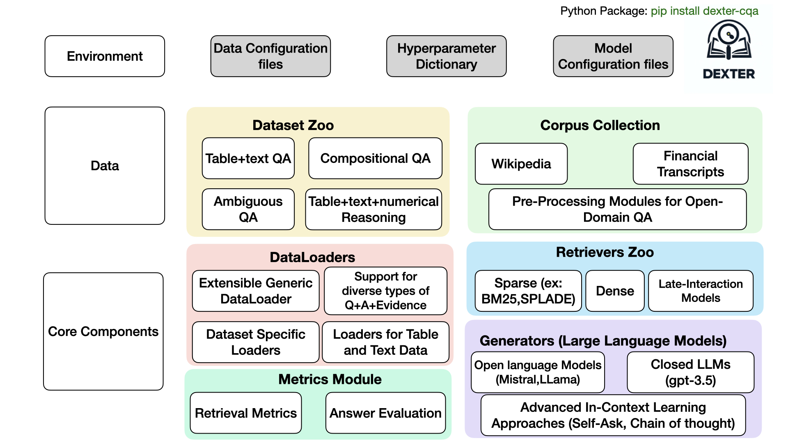

<p align="center">
  
</p>

<p align="center">
  
</p>


# DEXTER (Benchmarking Complex QA)

Answering complex questions is a difficult task that requires knowledge retrieval. 
To address this, we propose our easy to use and  extensible benchmark composing diverse complex QA tasks and provide a toolkit to evaluate zero-shot retrieval capabilities of state-of-the-art dense and sparse retrieval models in an open-domain setting. Additionally, since context-based reasoning is key to complex QA tasks, we extend our toolkit with various LLM engines. Both the above components together allow our users to evaluate the various components in the Retrieval Augmented Generation pipeline.

For components in retrieval we draw inspiration from BEIR (https://github.com/beir-cellar/beir) and reuse some parts of implementation with modification suited to our setup. We thank the authors for open-sourcing their code.

# Colab notebook
[](https://colab.research.google.com/drive/1UOZ_JuDcWGKvwcPs4ygCEoGCUUgC1PUs?usp=sharing)

# Setup (from source)
1) Clone the repo <br />
2) Create a conda environment conda create -n bcqa  <br />
3) pip install -e .<br />

# From pip
pip install dexter-cqa
# Datasets

|  Dataset Name  |  Dataset alias |                  Homepage                 |                Characteristics               | #Questions | Corpus Size |
|:--------------:|:--------------:|:-----------------------------------------:|:--------------------------------------------:|:----------:|:-----------:|
| MusiqueQA      | musiqueqa (2-hop only)      | [Link](https://github.com/StonyBrookNLP/musique)  | Connected multi-hop reasoning   | 16.8k       | 570k       |
| WikiMultiHopQA | wikimultihopqa | [Link](https://github.com/Alab-NII/2wikimultihop) | Comparative multi-hop reasoning              | 190k       | 570k        |
| StrategyQA     | strategyqa     | [Link](https://allenai.org/data/strategyqa)       | Multi-hop reasoning, Implicit Reasoning      | 2.7k       | 26.6M       |
| AmbigQA        | ambignq        | [Link](https://nlp.cs.washington.edu/ambigqa/)    | Ambiguous Questions                          | 12k        | 24.3M       |
| OTT-QA         | ottqa          | [Link](https://ott-qa.github.io/)                 | Table and Text multi-hop reasoning           | 2.1k       | 6.5M        |
| TAT-QA         | tatqa          | [Link](https://nextplusplus.github.io/TAT-QA/)    | Financial Table and Text multi-hop reasoning | 2.9k       | 7000        |
| FinQA          | finqa          | [Link](https://github.com/czyssrs/FinQA)          | Financial Table and Text multi-hop reasoning | 8k         | 24.8k       |

## Important!! All datasets can be found at one place at [Datasets](https://gitlab.tudelft.nl/venkteshviswan/bcqa_data)
# Retrievers
|    Name    | Paradigm | More |
|:----------:|:--------:|:----:|
| BM25       | Lexical  | [Link](https://www.staff.city.ac.uk/~sbrp622/papers/foundations_bm25_review.pdf) |
| SPLADE     | Sparse   | [Link](https://github.com/naver/splade) |
| DPR        | Dense    | [Link](https://github.com/facebookresearch/DPR) |
| ANCE       | Dense    | [Link](https://github.com/microsoft/ANCE) |
| tas-b      | Dense    | [Link](https://github.com/sebastian-hofstaetter/tas-balanced-dense-retrieval) |
| MPNet      | Dense    | [Link](https://github.com/microsoft/MPNet) |
| Contriever | Dense    | [Link](https://github.com/facebookresearch/contriever) |
| ColBERTv2  | Late-Interaction    | [Link](https://github.com/stanford-futuredata/ColBERT) |

# Retrieving over large corpus collections
Since some of the datasets have corpus collection with large sizes (millions), we also support chunking of corpus when doing retrieval. To avoid storing docs in memory inspired by the issue https://github.com/beir-cellar/beir/pull/117 we maintain a list of top-k docs with scores when computing scores chunkwise using heapq.

# LLM Engines
- OpenAI models
- Mistral
- Llama
- FlanT5

  Our toolkit is flexible and can support further new generative models. it will be an ongoing effort and we welcome contributions.


# Project Structure
- data
    - datastructures: Basic data classes for question, answer and others needed in the pipeline.
    - dataloaders: Loaders that take raw json/zip file data and convert them to the format needed in the pipeline
- retriever: Retrievers that take the data loaders and perform retrieval to produce results.
    - dense : dense retrievers like ColBERTv2,ANCE, Contriever, MpNet, DPR and Tas-B
    - lexical: lexical retrievers like BM25
    - sparse: Sparse retrievers like SPLADE
- llms: LLM engine orchestrator and implementation for inference using LLama2, Mistral, OpenAI models and Flan-T5 ( more models to come soon.)
- config: Configuration files with constants and initialization.
- tests: test cases for the above components
- utils: utilities needed in the pipeline like retrieval accuracy calculation and matching.

# Running Evaluation
Below is an example script demonstrating how to load a dataset from our benchmark (ambignq here), feed it into one of our retrievers(ANCE here), and evaluate the retrieval quality against the relevance labels provided by the dataset.
```python
from dexter.config.constants import Split
from dexter.data.loaders.RetrieverDataset import RetrieverDataset
from dexter.retriever.dense.ANCE import ANCE
from dexter.utils.metrics.SimilarityMatch import CosineSimilarity
from dexter.utils.metrics.retrieval.RetrievalMetrics import RetrievalMetrics

if __name__ == "__main__":
    # Ensure in config.ini the path to the raw data files are linked under [Data-Path]
    # ambignq = '<path to the data file>
    # ambignq-corpus = '<path to the corpus file>'

    # You can set the split to one of Split.DEV, Split.TEST or Split.TRAIN
    # Setting tokenizer=None only loads only the raw data processed into our standard data classes, if tokenizer is set, the data is also tokenized and stored in the loader.
    loader = RetrieverDataset("ambignq","ambignq-corpus",
                               "config.ini", Split.DEV,tokenizer=None)

    # Initialize your retriever configuration
    config_instance = DenseHyperParams(query_encoder_path="facebook/contriever",
                                     document_encoder_path="facebook/contriever"
                                     ,batch_size=32,show_progress_bar=True)

    # From data loader loads list of queries, corpus and relevance labels.
    queries, qrels, corpus = loader.qrels()

    #Perform Retrieval
    contrvr_search = Contriever(config_instance)   
    similarity_measure = CosineSimilarity()
    response = contrvr_search.retrieve(corpus,queries,100,similarity_measure,chunk=True,chunksize=400000)


    #Evaluate retrieval metrics
    metrics = RetrievalMetrics(k_values=[1,10,100])
    print(metrics.evaluate_retrieval(qrels=qrels,results=response))
```
# Running Evaluation for Results in Paper
All evaluation scripts dataset wise can be found in the evaluation folder
## Example TAT-QA ( When building from source)
```
curl https://gitlab.tudelft.nl/venkteshviswan/bcqa_data/-/raw/main/tatqa.zip -o tatqa.zip
```
In evaluation/config.ini configure the corresponding paths to downloaded files
configure project root directory to PYTHONPATH variable
```
export PYTHONPATH=/path

export OPENAI_KEY=<your openai key>

export huggingface_token = <your huggingface token to access llama2  >

```

If you are using Elasticsearch (ES) installation >8 please export the following values based on your ES setup

```
export ca_certs = <path to http_ca.crt path in your ES installation>

export http_auth = <your elasticsearch password>
```
## To reproduce dpr results run
```
python3 evaluation/tatqa/run_dpr_inference.py
```

## To reproduce colbert results run
```
python3 evaluation/tatqa/test_tctcolbert_inference.py
```
Similarly other retrievers can be also run using other scripts in the folder

# To Reproduce LLm Results
```
export OPENAI_KEY="<you key here>"
```
To run openAI model using colbert docs, run:
```
python3 evaluation/tatqa/llms/run_rag_few_shot_cot.py
```
Above experiment would help get numbers for FEW-SHOT-COT for gpt-3.5-turbo which can be checked with Table 3.
# Building your own custom dataset

You can quickly build your own dataset in three steps:

### 1) Loading the question, answer and evidence records

The base data loader by default takes a json file of the format

```
[{'id':'..','question':'..','answer':'..'}]
```
Each of the train, test and val splits should under their own json files named under your dir
- /dir_path/train.json
- /dir_path/test.json
- /dir_path/validation.json
  
If you want to create your custom loader:
Within the directory data/dataloaders, Create your Dataloader by extending from BaseDataLoader
```python

class MyDataLoader(BaseDataLoader):
    def load_raw_dataset(self,split):
        dataset = self.load_json(split)
        
        records =  '''your code to transform the elements in json to List[Sample(idx:str,question:Question,answer:Answer,evidence:Evidence)]'''
        # If needed you can also extend from Question,Answer and Evidence dataclasses to form your own types
        self.raw_data = records
    def load_tokenized(self):
        ''' If required overwrite this function to build custom tkenization method of your dataset '''

```

Under config.ini:
```
my-dataset = 'dir_path'
```
### 1) Loading the corpus
To load your own corpus you can provide a json file of the standard format:
```
{"idx":{"text":"...","title":"..",'type":"table/text"}}
```

Under config.ini add:
```
my-dataset-corpus = '< path to the json file of above format >'
```
### 3) Add your dataset alias to constants

Within config.constants:
```python
class Dataset:
    AMBIGQA = "ambignq"
    WIKIMULTIHOPQA = "wikimultihopqa"
    ...
    MY_DATASET = "my-dataset"
```

and within data/loader/DataLoaderFactory.py:

```python
   def create_dataloader(
...
        if Dataset.AMBIGQA in dataloader_name:
            loader = AmbigQADataLoader
        elif Dataset.FINQA in dataloader_name:
            loader = FinQADataLoader
        ..
        elif Dataset.MY_DATASET in dataloader_name:
            loader = MyDataLoader
    
```


Your dataset is now ready to be loaded and used.

a) You can load the dataloader as:
```python
loader_factory = DataLoaderFactory()
loader = loader_factory.create_dataloader("my-dataset", config_path="config.ini", split=Split.DEV, batch_size=10)
```

b) You can load the corpus as:
```python
loader = PassageDataLoader(dataset="my-dataset-corpus",subset_ids=None,config_path="config.ini",tokenizer=None)
```

c) You can load RetrieverDataset as:
```python
loader = RetrieverDataset("my-dataset","my-dataset-corpus",
                               "config.ini", Split.DEV,tokenizer=None)
```


# Building your own retrievers

To build your own retriever you can extend from the class bcqa/retriever/BaseRetriever.py and use it in your evaluation script.

# Citing & Authors
Thanks to the following collaborators: <br />
<b> Venktesh Viswanathan </b> <br />
<b> Deepali Prabhu </b> <br />
<b> Avishek Anand </b> <br />


```
@misc{venky:2024:dexter,
      title={DEXTER: A Benchmark for open-domain Complex Question Answering using LLMs}, 
      author={Venktesh V. and Deepali Prabhu and Avishek Anand},
      year={2024},
      eprint={2406.17158},
      archivePrefix={arXiv},
      primaryClass={cs.CL},
      url={https://arxiv.org/abs/2406.17158}, 
}
```


             
